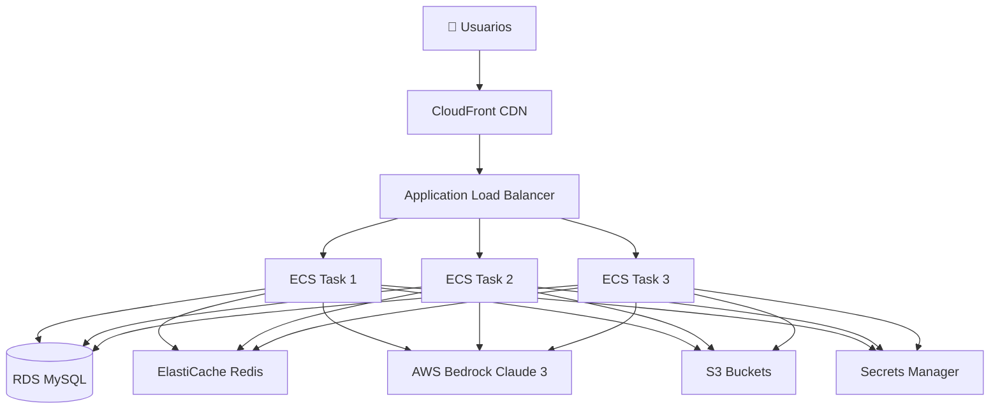

# Arquitectura AWS - Learning Agent Web
## Despliegue Mínimo con AWS Bedrock
Estimamos 100 usuarios piloto y aproximadamente una escalada de hasta 1000 usuarios (variable en relación a demanda de los servicios living lab) entrando a producción.

También si creen que la arquitectura puede simplificarse no duden en comentarnos.

### 🏗️ Diagrama de Arquitectura

```
┌─────────────────────────────────────────────────────────────────────┐
│                          INTERNET / USUARIOS                          │
└────────────────────────────────┬──────────────────────────────────────┘
                                 │
                                 ▼
┌─────────────────────────────────────────────────────────────────────┐
│                        AWS ROUTE 53 (DNS)                            │
│                      livinglab360.uniminuto.edu                    │
└────────────────────────────────┬──────────────────────────────────────┘
                                 │
                                 ▼
┌─────────────────────────────────────────────────────────────────────┐
│            CLOUDFRONT (CDN + HTTPS + Cache estático)                 │
│                    SSL/TLS Certificate Manager                       │
└────────────────────────────────┬──────────────────────────────────────┘
                                 │
                                 ▼
┌─────────────────────────────────────────────────────────────────────┐
│                  APPLICATION LOAD BALANCER (ALB)                     │
│                      Health Checks + HTTPS                           │
└────────────────────────────────┬──────────────────────────────────────┘
                                 │
                                 ▼
┌─────────────────────────────────────────────────────────────────────┐
│                           AWS ECS FARGATE                            │
│  ┌───────────────────────────────────────────────────────────────┐  │
│  │  Learning Agent Container (FastAPI + Python 3.11)             │  │
│  │  • 0.5 vCPU / 1 GB RAM (mínimo)                              │  │
│  │  • 1-3 tasks (auto-scaling)                                   │  │
│  │  • Puerto 8000                                                │  │
│  │  • Health check: /api/mcp/health                             │  │
│  └───────────────────────────────────────────────────────────────┘  │
└───────┬─────────────────────┬──────────────────────┬─────────────────┘
        │                     │                      │
        ▼                     ▼                      ▼
┌─────────────┐    ┌──────────────────┐    ┌──────────────────┐
│  RDS MySQL  │    │  ElastiCache     │    │  AWS BEDROCK     │
│  (t3.micro) │    │  Redis           │    │  (Claude 3)      │
│             │    │  (t3.micro)      │    │                  │
│  • Users    │    │  • Sessions      │    │  • Chat AI       │
│  • Paths    │    │  • Cache         │    │  • Embeddings    │
│  • Progress │    │  • Queue         │    │  • Streaming     │
└─────────────┘    └──────────────────┘    └──────────────────┘
        │                     │                      │
        └─────────────────────┴──────────────────────┘
                              │
                              ▼
                    ┌──────────────────┐
                    │   S3 BUCKET      │
                    │                  │
                    │  • Static files  │
                    │  • Logs          │
                    │  • Backups       │
                    │  • CSV data      │
                    └──────────────────┘
                              │
                              ▼
                    ┌──────────────────┐
                    │  SECRETS MGR     │
                    │                  │
                    │  • DB password   │
                    │  • JWT secret    │
                    │  • API keys      │
                    └──────────────────┘
```

---

## 📊 Componentes de la Arquitectura

### 1. **Compute Layer** - ECS Fargate

**Servicio**: Amazon ECS con AWS Fargate (sin gestión de servidores)

```yaml
Configuración Mínima:
  - CPU: 0.5 vCPU (512)
  - RAM: 1 GB
  - Tasks: 1-3 (auto-scaling)
  - Container: learning-agent-web:latest
  - Registry: Amazon ECR (Elastic Container Registry)
```

**Ventajas**:
- Sin gestión de servidores EC2
- Pago por uso (solo cuando está corriendo)
- Auto-scaling automático
- Integración nativa con ALB

**Costo estimado**: ~$15-30/mes

---

### 2. **Load Balancer** - Application Load Balancer (ALB)

```yaml
Configuración:
  - Tipo: Application Load Balancer
  - Listeners: HTTP (80) → HTTPS (443)
  - Target Group: ECS Fargate tasks
  - Health Check: GET /api/mcp/health
```

**Costo estimado**: ~$16/mes + tráfico

---

### 3. **Database** - Amazon RDS MySQL

```yaml
Configuración Mínima:
  - Instance: db.t3.micro
  - Engine: MySQL 8.0
  - Storage: 20 GB SSD
  - Multi-AZ: No (mínimo) | Sí (producción)
  - Backup: 7 días
```

**Alternativa más económica**: Amazon RDS Aurora Serverless v2
- Escala automáticamente desde 0.5 ACU
- Solo pagas por lo que usas

**Costo estimado**: 
- RDS MySQL t3.micro: ~$15/mes
- Aurora Serverless v2: ~$40-60/mes (más escalable)

---

### 4. **Cache** - ElastiCache Redis

```yaml
Configuración Mínima:
  - Node Type: cache.t3.micro
  - Engine: Redis 7.x
  - Nodes: 1 (mínimo) | 2-3 (replicación)
  - Uso: Session storage, cache de consultas
```

**Alternativa más económica**: DynamoDB para sesiones
- Modelo serverless
- Pay-per-request

**Costo estimado**: ~$13/mes

---

### 5. **IA** - AWS Bedrock (Claude 3)
Usar posiblemente Claude Sonnet 4.5 o GPT OSS 120b (costo consistencia)
```yaml
Modelos Disponibles:
  - Claude 3 Haiku: Más económico, rápido
  - Claude 3 Sonnet: Balance costo/calidad
  - Claude 3 Opus: Mayor calidad
  
Características:
  - Streaming de respuestas
  - Function calling (MCP tools)
  - Embeddings para búsqueda semántica
  - Sin gestión de infraestructura
```

**Ventajas sobre OpenAI**:
- Datos permanecen en AWS
- Integración nativa con servicios AWS
- Mejor compliance (GDPR, HIPAA)
- Costos más predecibles

**Costo estimado**: 
- Claude 3 Haiku: $0.25 / 1M tokens input, $1.25 / 1M tokens output
- Para ~10,000 conversaciones/mes: ~$15-30/mes

---

### 6. **Storage** - Amazon S3

```yaml
Buckets:
  - learning-agent-static: Archivos estáticos (CSS, JS, imágenes)
  - learning-agent-data: CSVs, backups
  - learning-agent-logs: Logs de aplicación
  
Configuración:
  - Versioning: Habilitado
  - Lifecycle: Mover a Glacier después de 90 días
  - Encryption: AES-256
```

**Costo estimado**: ~$1-3/mes (50 GB)

---

### 7. **Secrets Management** - AWS Secrets Manager

```yaml
Secrets Almacenados:
  - DB_PASSWORD: Password de RDS
  - JWT_SECRET_KEY: Para tokens JWT
  - REDIS_PASSWORD: Password de Redis (opcional)
```

**Alternativa**: AWS Systems Manager Parameter Store (gratis hasta 10,000 parámetros)

**Costo estimado**: ~$0.40/secret/mes = ~$1.20/mes

---

### 8. **CDN** - CloudFront

```yaml
Configuración:
  - Origin: ALB
  - Cache Behavior: Cache archivos estáticos
  - SSL/TLS: AWS Certificate Manager (gratis)
  - Gzip Compression: Habilitado
```

**Costo estimado**: ~$1-10/mes (depende del tráfico)

---

### 9. **DNS** - Route 53
REVISAR
```yaml
Configuración:
  - Hosted Zone: uniminuto.edu
  - Hosted Zone: 
  - Record: learning-agent.uniminuto.edu → CloudFront
```

**Costo estimado**: ~$0.50/mes

---

## 💰 Costo Total Estimado Mensual

### Configuración Mínima (Desarrollo/Lab)

| Servicio | Configuración | Costo/mes |
|----------|--------------|-----------|
| ECS Fargate | 0.5 vCPU, 1 GB, 1 task | $15 |
| ALB | Básico | $16 |
| RDS MySQL | t3.micro, 20 GB | $15 |
| ElastiCache | t3.micro Redis | $13 |
| AWS Bedrock | ~10K conversaciones | $20 |
| S3 | 50 GB | $2 |
| CloudFront | Bajo tráfico | $5 |
| Secrets Manager | 3 secrets | $1 |
| Route 53 | 1 hosted zone | $0.50 |
| **TOTAL** | | **~$87/mes** |

### Configuración Optimizada (Producción)

| Servicio | Configuración | Costo/mes |
|----------|--------------|-----------|
| ECS Fargate | 1 vCPU, 2 GB, 2-3 tasks | $45 |
| ALB | Con SSL/health checks | $16 |
| Aurora Serverless v2 | 0.5-2 ACU | $50 |
| ElastiCache | t3.small + réplica | $40 |
| AWS Bedrock | ~50K conversaciones | $75 |
| S3 | 100 GB + lifecycle | $5 |
| CloudFront | Tráfico medio | $15 |
| Secrets Manager | 3 secrets | $1 |
| Route 53 | 1 hosted zone | $0.50 |
| **TOTAL** | | **~$247/mes** |

---

## 🚀 Diagrama de Despliegue



---

## 🔒 Seguridad

### 1. **Network Security**

```yaml
VPC Configuration:
  - VPC: Custom VPC (10.0.0.0/16)
  - Public Subnets: 2 AZs para ALB
  - Private Subnets: 2 AZs para ECS, RDS, Redis
  - NAT Gateway: 1 para acceso saliente desde private subnets
  
Security Groups:
  - ALB-SG: Entrada 80/443 desde 0.0.0.0/0
  - ECS-SG: Entrada 8000 solo desde ALB-SG
  - RDS-SG: Entrada 3306 solo desde ECS-SG
  - Redis-SG: Entrada 6379 solo desde ECS-SG
```

### 2. **IAM Roles**

```yaml
ECS Task Role:
  - bedrock:InvokeModel (AWS Bedrock)
  - s3:GetObject (leer CSVs)
  - s3:PutObject (logs)
  - secretsmanager:GetSecretValue
  - logs:CreateLogStream
  
ECS Task Execution Role:
  - ecr:GetAuthorizationToken
  - ecr:BatchCheckLayerAvailability
  - ecr:GetDownloadUrlForLayer
```

### 3. **Encryption**

```yaml
At Rest:
  - RDS: Encryption habilitado (KMS)
  - S3: AES-256 o KMS
  - ElastiCache: Encryption at rest
  
In Transit:
  - ALB: HTTPS only (redirect HTTP → HTTPS)
  - CloudFront: TLS 1.2+
  - RDS: SSL/TLS connections
```

---

## 📝 Implementación Paso a Paso

### Fase 1: Infraestructura Base (Día 1-2)

```bash
# 1. Crear VPC y subnets
aws cloudformation create-stack \
  --stack-name learning-agent-network \
  --template-body file://cloudformation/network.yaml

# 2. Crear RDS MySQL
aws cloudformation create-stack \
  --stack-name learning-agent-database \
  --template-body file://cloudformation/rds.yaml

# 3. Crear ElastiCache Redis
aws cloudformation create-stack \
  --stack-name learning-agent-cache \
  --template-body file://cloudformation/redis.yaml

# 4. Crear S3 buckets
aws s3 mb s3://learning-agent-static-prod
aws s3 mb s3://learning-agent-data-prod
aws s3 mb s3://learning-agent-logs-prod
```

### Fase 2: Configurar Secrets (Día 2)

```bash
# Crear secrets
aws secretsmanager create-secret \
  --name learning-agent/db-password \
  --secret-string "your-secure-password"

aws secretsmanager create-secret \
  --name learning-agent/jwt-secret \
  --secret-string "your-jwt-secret-key"

# Habilitar AWS Bedrock
aws bedrock-runtime invoke-model \
  --model-id anthropic.claude-3-haiku-20240307-v1:0 \
  --region us-east-1
```

### Fase 3: Container y ECS (Día 3-4)

```bash
# 1. Construir imagen Docker
docker build -t learning-agent-web:latest .

# 2. Crear ECR repository
aws ecr create-repository --repository-name learning-agent-web

# 3. Push imagen a ECR
aws ecr get-login-password --region us-east-1 | \
  docker login --username AWS --password-stdin \
  123456789.dkr.ecr.us-east-1.amazonaws.com

docker tag learning-agent-web:latest \
  123456789.dkr.ecr.us-east-1.amazonaws.com/learning-agent-web:latest

docker push 123456789.dkr.ecr.us-east-1.amazonaws.com/learning-agent-web:latest

# 4. Crear ECS Cluster
aws ecs create-cluster --cluster-name learning-agent-cluster

# 5. Crear Task Definition y Service
aws ecs register-task-definition \
  --cli-input-json file://ecs/task-definition.json

aws ecs create-service \
  --cluster learning-agent-cluster \
  --service-name learning-agent-service \
  --task-definition learning-agent-task \
  --desired-count 2 \
  --launch-type FARGATE
```

### Fase 4: Load Balancer y CDN (Día 5)

```bash
# 1. Crear ALB
aws elbv2 create-load-balancer \
  --name learning-agent-alb \
  --subnets subnet-xxx subnet-yyy \
  --security-groups sg-xxx

# 2. Crear CloudFront distribution
aws cloudfront create-distribution \
  --origin-domain-name alb-xxx.us-east-1.elb.amazonaws.com

# 3. Configurar Route 53
aws route53 change-resource-record-sets \
  --hosted-zone-id Z123456 \
  --change-batch file://route53/record-set.json
```

---

## 🔄 Migración de OpenAI a AWS Bedrock

### Cambios en el Código

```python
# backend/app/services/bedrock_service.py

import boto3
import json
from typing import List, Dict, AsyncGenerator

class BedrockService:
    def __init__(self):
        self.client = boto3.client(
            service_name='bedrock-runtime',
            region_name='us-east-1'
        )
        self.model_id = "anthropic.claude-3-haiku-20240307-v1:0"
    
    async def chat_completion_stream(
        self, 
        messages: List[Dict[str, str]],
        tools: List[Dict] = None
    ) -> AsyncGenerator[str, None]:
        """
        Stream chat completion desde AWS Bedrock Claude 3
        """
        # Convertir formato OpenAI a Bedrock
        prompt = self._convert_messages_to_claude_format(messages)
        
        body = json.dumps({
            "anthropic_version": "bedrock-2023-05-31",
            "max_tokens": 1000,
            "messages": messages,
            "temperature": 0.7,
            "top_p": 0.9,
            "tools": tools or []
        })
        
        # Invocar modelo con streaming
        response = self.client.invoke_model_with_response_stream(
            modelId=self.model_id,
            body=body
        )
        
        # Stream de respuesta
        for event in response['body']:
            chunk = json.loads(event['chunk']['bytes'].decode())
            
            if chunk['type'] == 'content_block_delta':
                if 'delta' in chunk and 'text' in chunk['delta']:
                    yield chunk['delta']['text']
    
    def _convert_messages_to_claude_format(self, messages: List[Dict]) -> List[Dict]:
        """
        Convertir formato de mensajes OpenAI a Claude
        """
        claude_messages = []
        for msg in messages:
            claude_messages.append({
                "role": msg["role"],
                "content": msg["content"]
            })
        return claude_messages
```

### Actualizar docker-compose.yml

```yaml
environment:
  # Remover OpenAI
  # - OPENAI_API_KEY=${OPENAI_API_KEY}
  
  # Agregar AWS Bedrock
  - AWS_REGION=us-east-1
  - AWS_ACCESS_KEY_ID=${AWS_ACCESS_KEY_ID}
  - AWS_SECRET_ACCESS_KEY=${AWS_SECRET_ACCESS_KEY}
  - BEDROCK_MODEL_ID=anthropic.claude-3-haiku-20240307-v1:0
```

---

## 📊 Monitoring y Observabilidad

### CloudWatch

```yaml
Logs Groups:
  - /ecs/learning-agent-web
  - /aws/bedrock/model-invocations
  
Metrics:
  - ECS CPU/Memory utilization
  - ALB request count, latency
  - RDS connections, CPU
  - Bedrock token usage, latency
  
Alarms:
  - ECS High CPU > 80%
  - ALB 5XX errors > 10/min
  - RDS connections > 80%
  - Bedrock throttling
```

### CloudWatch Dashboard

```yaml
Widgets:
  - ECS Tasks: Running/Stopped
  - ALB Traffic: Requests/sec
  - Bedrock Invocations: Count + Cost
  - RDS Performance: Connections, queries/sec
  - Application Errors: 4XX, 5XX rates
```

---

## 🎯 Ventajas de esta Arquitectura

### ✅ Pros

1. **Serverless donde es posible**: Fargate, Bedrock, S3
2. **Escalabilidad automática**: ECS auto-scaling, Aurora Serverless
3. **Alta disponibilidad**: Multi-AZ, ALB, auto-healing
4. **Seguridad mejorada**: VPC privada, IAM roles, encryption
5. **Costos predecibles**: Pay-per-use en la mayoría de servicios
6. **AWS Bedrock**: Datos en AWS, mejor compliance

### ⚠️ Contras

1. **Costo inicial**: ~$87/mes mínimo vs $0 con OpenAI gratuito
2. **Complejidad**: Más servicios que gestionar
3. **Lock-in AWS**: Difícil migrar a otro proveedor
4. **Bedrock**: Menos modelos que OpenAI (por ahora)

---

## 🚀 Siguientes Pasos

1. **Crear templates CloudFormation/Terraform**
2. **Migrar código de OpenAI a Bedrock**
3. **Configurar CI/CD con AWS CodePipeline**
4. **Implementar monitoreo con CloudWatch**
5. **Pruebas de carga y optimización**

---

## 📞 Soporte

Para preguntas sobre esta arquitectura:
- **Email**: livinglab@uniminuto.edu
- **Documentación AWS**: https://docs.aws.amazon.com/

---

**Desarrollado para Living Lab UNIMINUTO**  
*Arquitectura AWS Cloud-Native con AWS Bedrock*